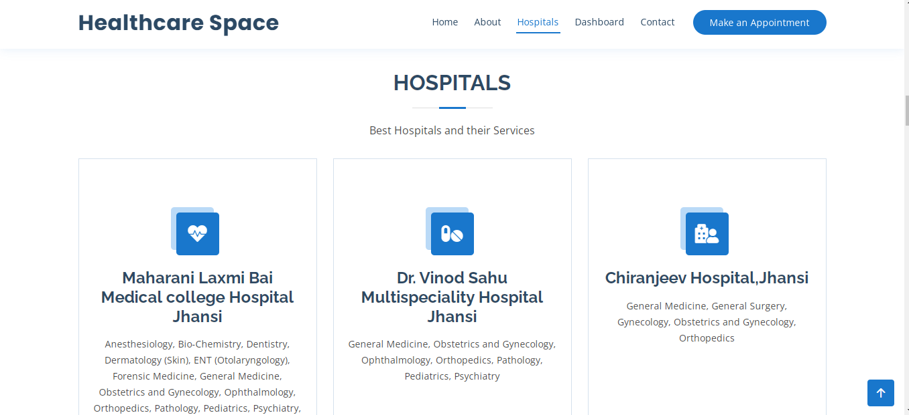
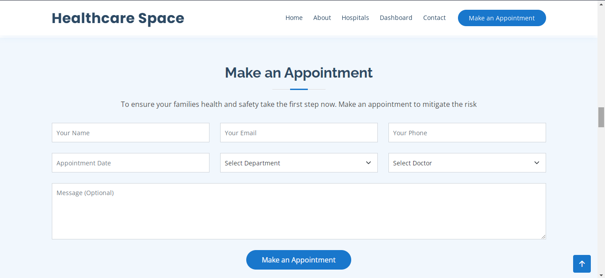
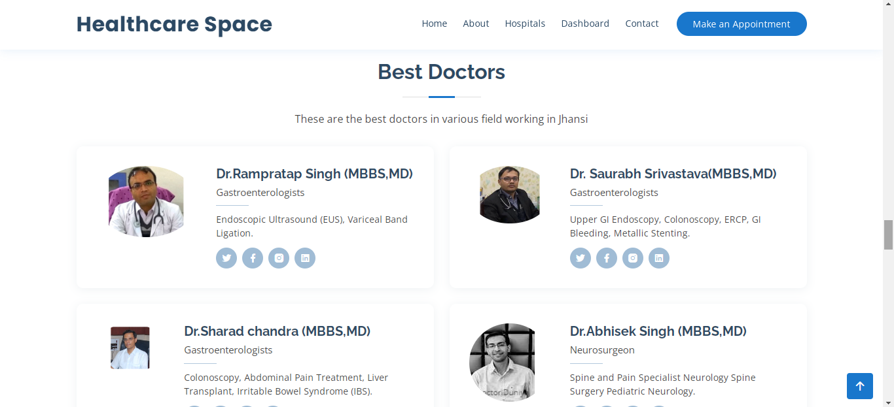
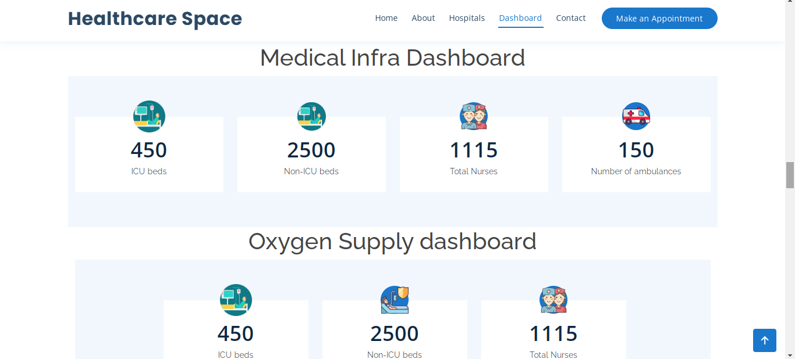

# Healthcare-Space

[Live link of website](https://shyamjitripathi.github.io/Healthcare-Space/)<br>

During Covid-19 period, many people lost their loved ones due to lack of information.Hence, we decided to build a website which will provide healthcare related facilities information to "Jhansi City" Resident.<br>

## Tech Stack
```
-HTML  
-CSS
-JavaScript
-Bootstrap
```

## Features 
```
1.Hospital List 
2.Appointment Booking
3.List of available doctors
4.Medical Infrastructure Dashboard
```

## Screenshots





